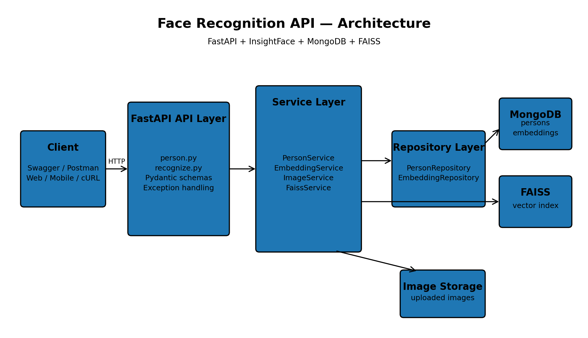
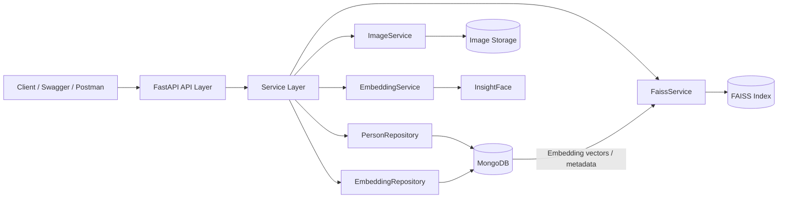

# Face Recognition API

A production-style face recognition backend built with **FastAPI, InsightFace, MongoDB, and FAISS**.

The application supports person management, multiple face images per person, face embeddings, FAISS similarity search, pagination, centralized exception handling, and a layered Repository/Service architecture.

## Architecture





### Layer responsibilities

| Layer | Responsibility |
|---|---|
| API | HTTP endpoints, request validation, response models |
| Service | Business logic and workflow orchestration |
| Repository | MongoDB persistence operations |
| EmbeddingService | Generate face embeddings using InsightFace |
| ImageService | Save/delete uploaded images |
| FaissService | Add, search, rebuild, and persist FAISS index |
| MongoDB | Person and embedding metadata/source of truth |
| FAISS | Derived vector-search index |

## Features

- Register a person with a face image
- Add multiple images to an existing person
- Store face embeddings in MongoDB
- FAISS vector similarity search
- Recognize a face from an uploaded image
- Get person details and registered images
- List persons with pagination
- Update person information
- Delete a person and associated images/embeddings
- Rebuild the FAISS index from stored embeddings
- Repository Pattern
- Service Layer
- Pydantic request/response DTOs
- Centralized logging and exception handling

## Project Structure

```text
face-recognition-api/
├── app/
│   ├── api/
│   │   ├── person.py
│   │   └── recognize.py
│   ├── core/
│   │   ├── config.py
│   │   ├── logger.py
│   │   ├── exceptions.py
│   │   └── handlers.py
│   ├── database/
│   ├── repositories/
│   │   ├── person_repository.py
│   │   └── embedding_repository.py
│   ├── services/
│   │   ├── person_service.py
│   │   ├── embedding_service.py
│   │   ├── image_service.py
│   │   └── faiss_services.py
│   ├── schemas/
│   │   └── person.py
│   ├── models/
│   │   └── person.py
│   └── main.py
├── faiss/
│   └── face.index
├── storage/
│   └── images/
├── tests/
├── .env
├── .env.example
├── .gitignore
├── requirements.txt
└── README.md
```

## Prerequisites

- Python 3.10+
- MongoDB local instance or MongoDB Atlas
- Git
- pip

Check:

```bash
python3 --version
pip --version
git --version
```

## Setup

### 1. Clone

```bash
git clone <YOUR_REPOSITORY_URL>
cd <YOUR_PROJECT_DIRECTORY>
```

### 2. Create virtual environment

macOS/Linux:

```bash
python3 -m venv .venv
source .venv/bin/activate
```

Windows:

```powershell
python -m venv .venv
.venv\Scripts\activate
```

Verify:

```bash
python --version
which python
```

### 3. Upgrade pip

```bash
python -m pip install --upgrade pip
```

### 4. Install dependencies

```bash
pip install -r requirements.txt
```

If you need to regenerate requirements:

```bash
pip freeze > requirements.txt
```

## MongoDB Configuration

For local MongoDB, make sure MongoDB is running.

macOS/Homebrew example:

```bash
brew services start mongodb-community
brew services list
```

For MongoDB Atlas, use the Atlas connection string in `.env`.

Create your environment file:

```bash
cp .env.example .env
```

Example:

```env
MONGODB_URI=mongodb://localhost:27017
MONGODB_DATABASE=face_recognition

FAISS_DIRECTORY=faiss
FAISS_INDEX_NAME=face.index

LOG_LEVEL=INFO
```

Use the exact variable names expected by `app/core/config.py`.

**Never commit `.env` or database credentials.**

## Run the Application

From the project root:

```bash
uvicorn app.main:app --reload --host 0.0.0.0 --port 8000
```

Alternative:

```bash
python -m uvicorn app.main:app --reload --host 0.0.0.0 --port 8000
```

Application:

```text
http://localhost:8000
```

Swagger:

```text
http://localhost:8000/docs
```

ReDoc:

```text
http://localhost:8000/redoc
```

## API Endpoints

| Method | Endpoint | Purpose |
|---|---|---|
| POST | `/persons` | Register a new person with an image |
| GET | `/persons` | List persons with pagination |
| GET | `/persons/{person_id}` | Get person details and images |
| PUT | `/persons/{person_id}` | Update person information |
| DELETE | `/persons/{person_id}` | Delete person and associated resources |
| POST | `/persons/{person_id}` | Add an image to an existing person |
| POST | `/recognize` | Recognize a face |

### Recommended add-image route

The current code uses:

```text
POST /persons/{person_id}
```

For a resource-oriented API, the preferred route is:

```text
POST /persons/{person_id}/images
```

If you change the router to that route, use it in the examples below.

## cURL Examples

### Register person

```bash
curl -X POST "http://localhost:8000/persons" \
  -F "name=Sandeep Sharma" \
  -F "email=sandeep@example.com" \
  -F "phone=9999999999" \
  -F "address=Bangalore" \
  -F "image=@/path/to/image.jpg"
```

### List persons

```bash
curl "http://localhost:8000/persons"
```

Pagination:

```bash
curl "http://localhost:8000/persons?page=1&size=10"
```

### Get person

```bash
curl "http://localhost:8000/persons/<PERSON_ID>"
```

### Update person

```bash
curl -X PUT "http://localhost:8000/persons/<PERSON_ID>" \
  -H "Content-Type: application/json" \
  -d '{
    "name": "Sandeep Sharma",
    "email": "new@example.com",
    "phone": "8888888888",
    "address": "Bangalore"
  }'
```

### Add another image

Current route:

```bash
curl -X POST "http://localhost:8000/persons/<PERSON_ID>" \
  -F "image=@/path/to/another-image.jpg"
```

Preferred route:

```bash
curl -X POST "http://localhost:8000/persons/<PERSON_ID>/images" \
  -F "image=@/path/to/another-image.jpg"
```

### Delete person

```bash
curl -X DELETE "http://localhost:8000/persons/<PERSON_ID>"
```

### Recognize face

```bash
curl -X POST "http://localhost:8000/recognize" \
  -F "image=@/path/to/query-image.jpg"
```

## Testing

Install test dependencies if needed:

```bash
pip install pytest pytest-asyncio httpx
```

Run all tests:

```bash
pytest
```

Verbose:

```bash
pytest -v
```

Specific test file:

```bash
pytest tests/test_person_service.py -v
```

Specific test:

```bash
pytest tests/test_person_service.py::test_get_person -v
```

Coverage:

```bash
pip install pytest-cov
pytest --cov=app --cov-report=term-missing
```

HTML coverage:

```bash
pytest --cov=app --cov-report=html
```

Open:

```text
htmlcov/index.html
```

## Recommended Test Cases

### Registration

- Valid face image
- No face detected
- Invalid input
- Multiple registrations

### Person

- Get existing person
- Get unknown person
- Person with multiple images
- Update existing person
- Update unknown person
- Delete existing person
- Delete unknown person

### Pagination

- Default page
- Page 2
- Custom page size
- `page=0`
- `size=0`
- `size>100`

### Images

- Add image to existing person
- Add multiple images
- Invalid image
- No face detected
- Delete individual image
- Verify FAISS rebuild

### Recognition

- Known face
- Unknown face
- No face detected
- Empty FAISS index

## FAISS Design

The application stores the generated embedding vector in MongoDB.

Example:

```json
{
  "person_id": "<PERSON_ID>",
  "image_path": "storage/images/<IMAGE>.jpg",
  "faiss_index": 0,
  "embedding": [0.123, -0.456, "..."],
  "created_at": "..."
}
```

MongoDB is the **source of truth** for embedding data.

FAISS is a **derived search index**.

Rebuild flow:

```text
MongoDB embeddings
        |
        v
Extract vectors
        |
        v
Create new empty FAISS index
        |
        v
Normalize vectors
        |
        v
Add vectors
        |
        v
Save face.index
```

This means the FAISS index can be recreated if it becomes stale or is lost.

## Multiple Images Per Person

The intended relationship is:

```text
Person
  |
  +-- Image 1 -> Embedding 1
  +-- Image 2 -> Embedding 2
  +-- Image 3 -> Embedding 3
```

The `persons` collection stores person information.

The `embeddings` collection stores one embedding document per face image.

## Useful Development Commands

Activate environment:

```bash
source .venv/bin/activate
```

Install dependencies:

```bash
pip install -r requirements.txt
```

Run API:

```bash
uvicorn app.main:app --reload
```

Run tests:

```bash
pytest -v
```

Update requirements:

```bash
pip freeze > requirements.txt
```

Deactivate:

```bash
deactivate
```

Check port 8000:

```bash
lsof -i :8000
```

Stop process:

```bash
kill <PID>
```

Run on another port:

```bash
uvicorn app.main:app --reload --port 8001
```

## Troubleshooting

### ModuleNotFoundError

Activate the virtual environment:

```bash
source .venv/bin/activate
```

Then:

```bash
pip install -r requirements.txt
```

### MongoDB connection error

Check:

- MongoDB is running
- `MONGODB_URI` is correct
- Database name is correct
- Atlas network access is configured if using Atlas

### FAISS dimension error

The current implementation expects:

```text
512-dimensional embeddings
```

If you change the embedding model, rebuild the FAISS index.

### Recreate FAISS index during development

If the application creates an empty index on startup:

```bash
rm -f faiss/face.index
```

Then restart:

```bash
uvicorn app.main:app --reload
```

### Port already in use

```bash
lsof -i :8000
```

Then:

```bash
kill <PID>
```

or run:

```bash
uvicorn app.main:app --reload --port 8001
```

## Git Workflow

Initialize:

```bash
git init
```

Check changes:

```bash
git status
```

Create branch:

```bash
git checkout -b feature/add-image-management
```

Stage:

```bash
git add .
```

Commit:

```bash
git commit -m "Add face image management"
```

Push:

```bash
git push -u origin feature/add-image-management
```

View history:

```bash
git log --oneline
```

## Security

Never commit:

```text
.env
credentials
MongoDB passwords
API keys
private keys
uploaded personal images
local database files
generated FAISS indexes
```

Production improvements should include:

- JWT authentication
- Role-based authorization
- HTTPS
- Image validation
- Upload size limits
- Rate limiting
- Secure object storage
- Structured logging
- Monitoring
- Health/readiness checks
- Background FAISS rebuilds

## Future Improvements

- Delete individual images
- Duplicate face detection
- Image quality validation
- JWT authentication
- Role-based authorization
- Unit and integration tests
- Docker / Docker Compose
- GitHub Actions CI/CD
- Health and readiness endpoints
- Structured JSON logging
- Background FAISS rebuild jobs
- Cloud object storage
- Production deployment

## License

Add your preferred license here.

Example:

```text
MIT License
```

---

**Built with FastAPI, InsightFace, MongoDB and FAISS.**
